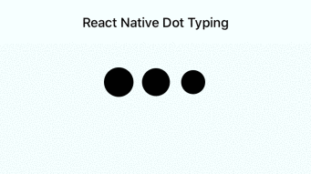

# react-native-dot-typing

💬 React Native Dot Typing

A dot typing animation for your React Native chat app based on <a href="https://uxdesign.cc/how-you-can-use-simple-trigonometry-to-create-better-loaders-32a573577eb4">simple trigonometry</a> to create better loaders.

## Features

- Smooth movement
- Customizable
- No dependencies
- Fast, lightweight and no images
- Uses `requestAnimationFrame`

## Demo



## Installation

- Using [npm](https://www.npmjs.com/#getting-started): `npm install react-native-dot-typing --save`
- Using [Yarn](https://yarnpkg.com/): `yarn add react-native-dot-typing`

## Example

```jsx
import React from "react";
import { DotTypingAnimation } from "react-native-dot-typing";

class Example extends React.Component {
  render() {
    return <DotTypingAnimation />;
  }
}
```

## Advanced Example

```jsx
import React from "react";
import { TypingAnimation } from "react-native-dot-typing";

class Example extends React.Component {
  render() {
    return (
      <DotTypingAnimation
        dotRadius={16}
        dotAmplitude={3}
        dotMargin={32}
        dotX={0}
        dotY={32}
      />
    );
  }
}
```

## Properties

- **`style`** _(Object)_ - Container styles; default is `{}`
- **`dotColor`** _(String)_ - Dot color; default is `#000` (black)
- **`dotStyles`** _(Object)_ - Dot styles; default is `{}`
- **`dotRadius`** _(Integer)_ - Dot radius; default is `2.5`
- **`dotMargin`** _(Integer)_ - Dot margin, the space between dots; default is `3`
- **`dotAmplitude`** _(Integer)_ - Dot amplitude; default is `3`
- **`dotSpeed`** _(Integer)_ - Dot speed, the speed of the whole animation view; default is `0.15`
- **`dotY`** _(Integer)_ - Dot y, the starting y coordinate; default is `6`
- **`dotX`** _(Integer)_ - Dot x, the x coordinate of the center dot; default is `12`
- **`show`** _(Boolean)_ - Visibility, whether the whole animation view is displayed or not; default is `true`

## License

- [MIT](LICENSE)
